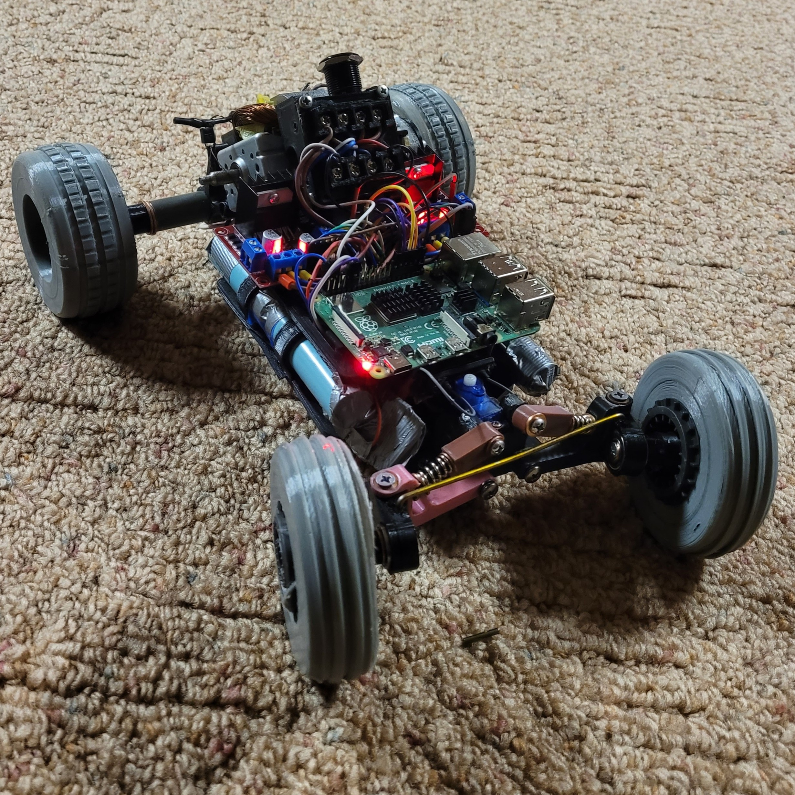

# Universal (AC Series) Powered RC Car

  

  
## Motor Control System
body
## Power System (Batteries, Voltage Regulator)
body
## 3D Design (Chasiss, Axles, Wheels, Drive Gears/Belt)
body
## Problems And Improvements
body
