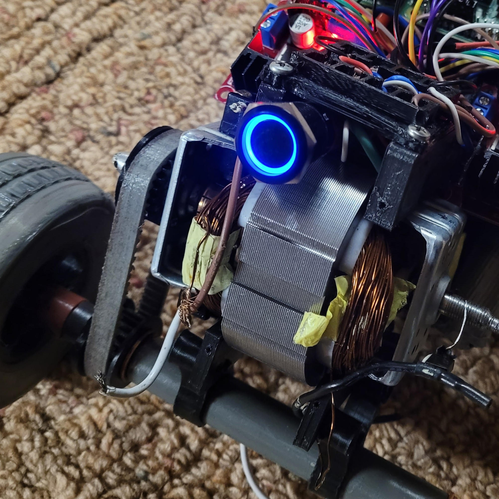
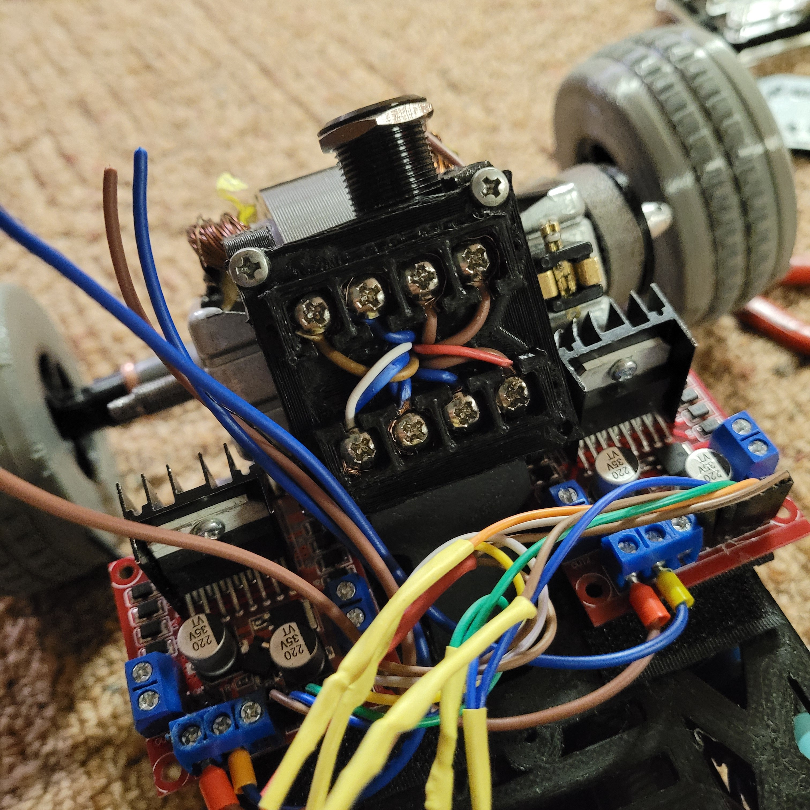
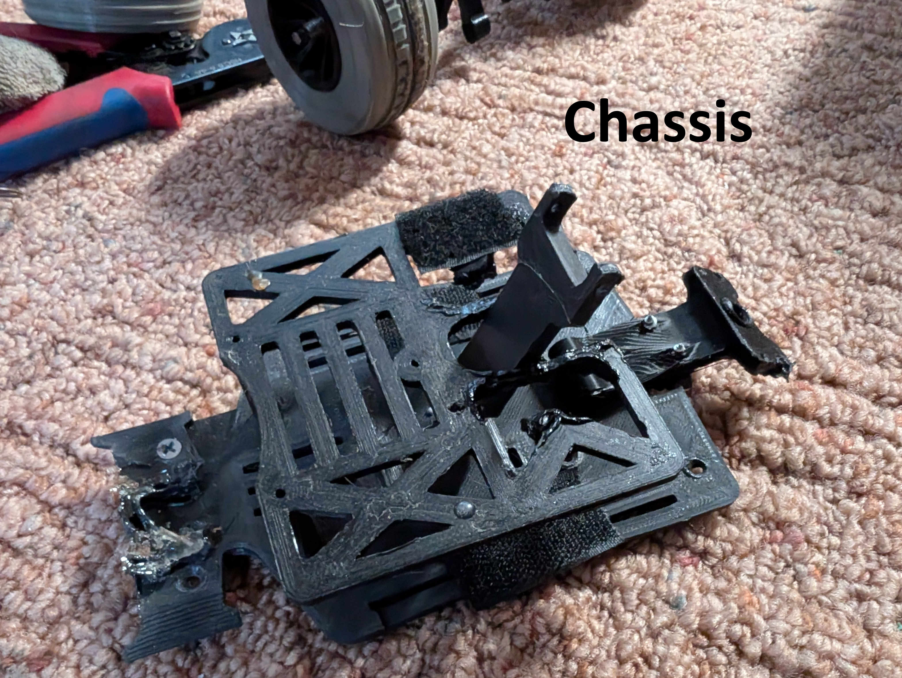
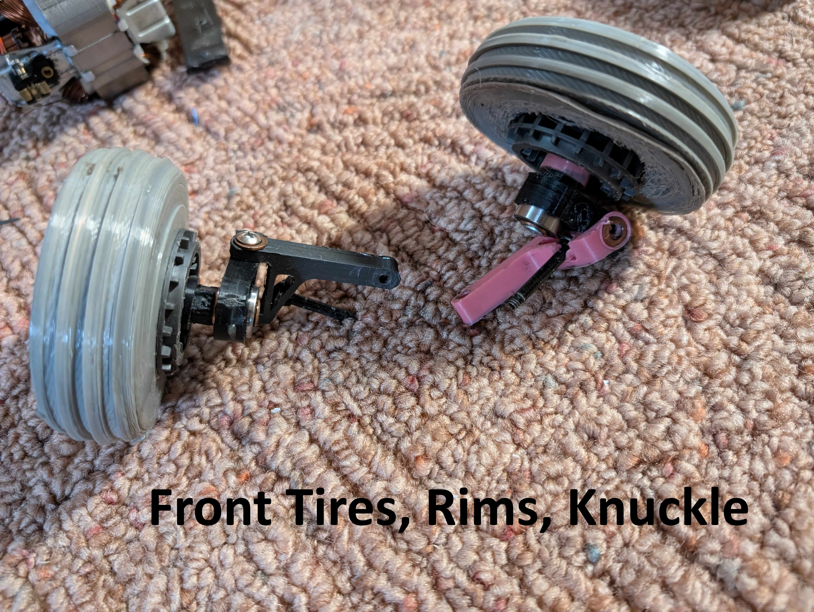
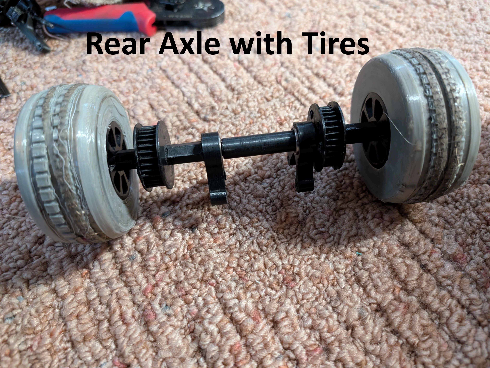
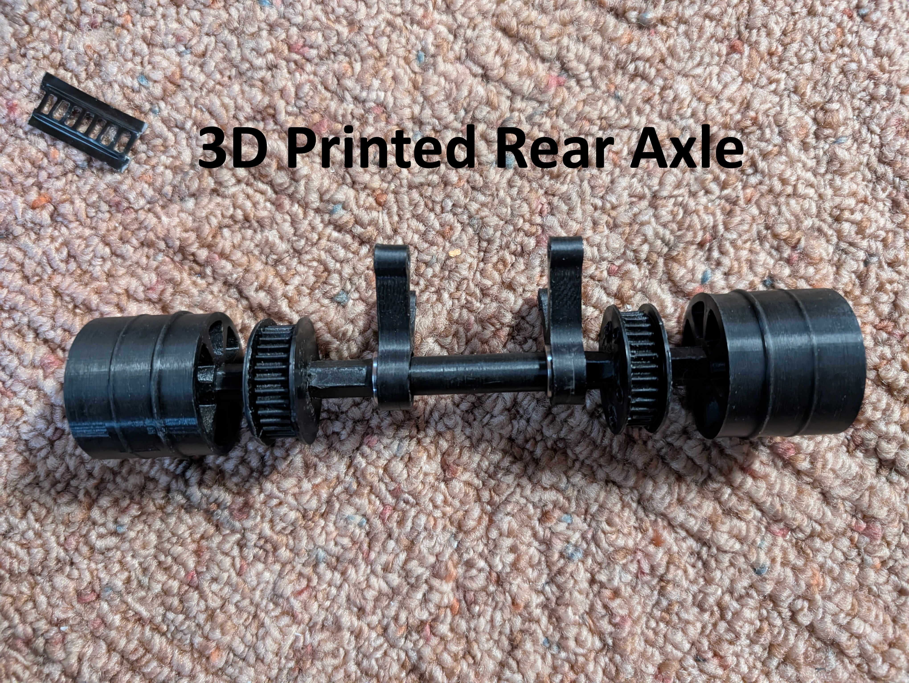
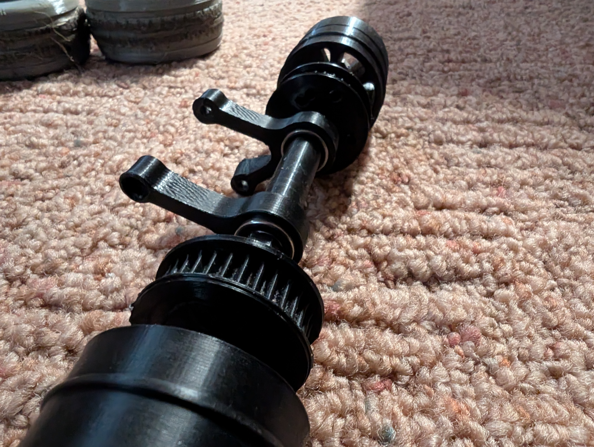
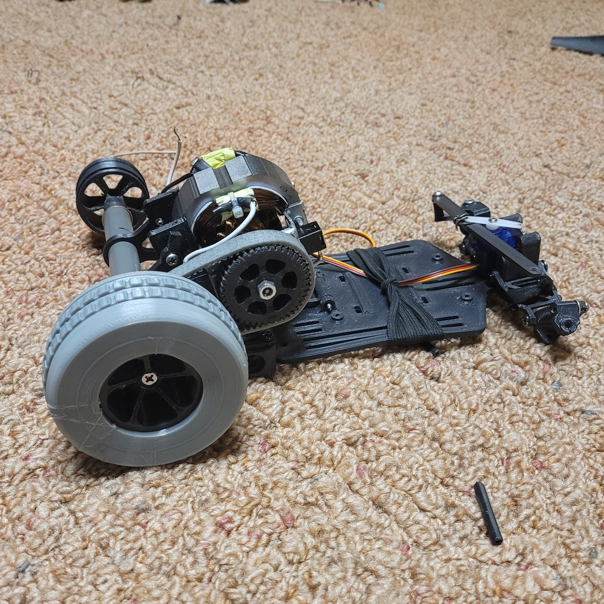
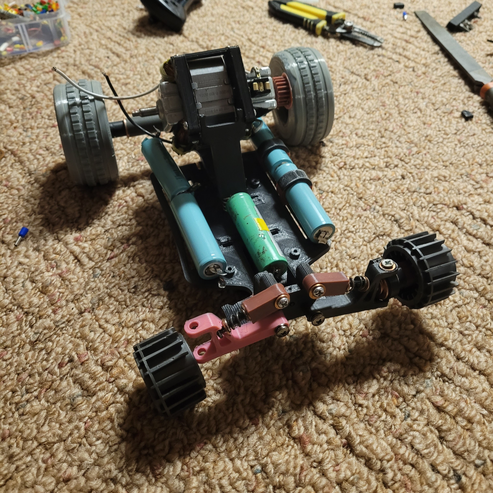
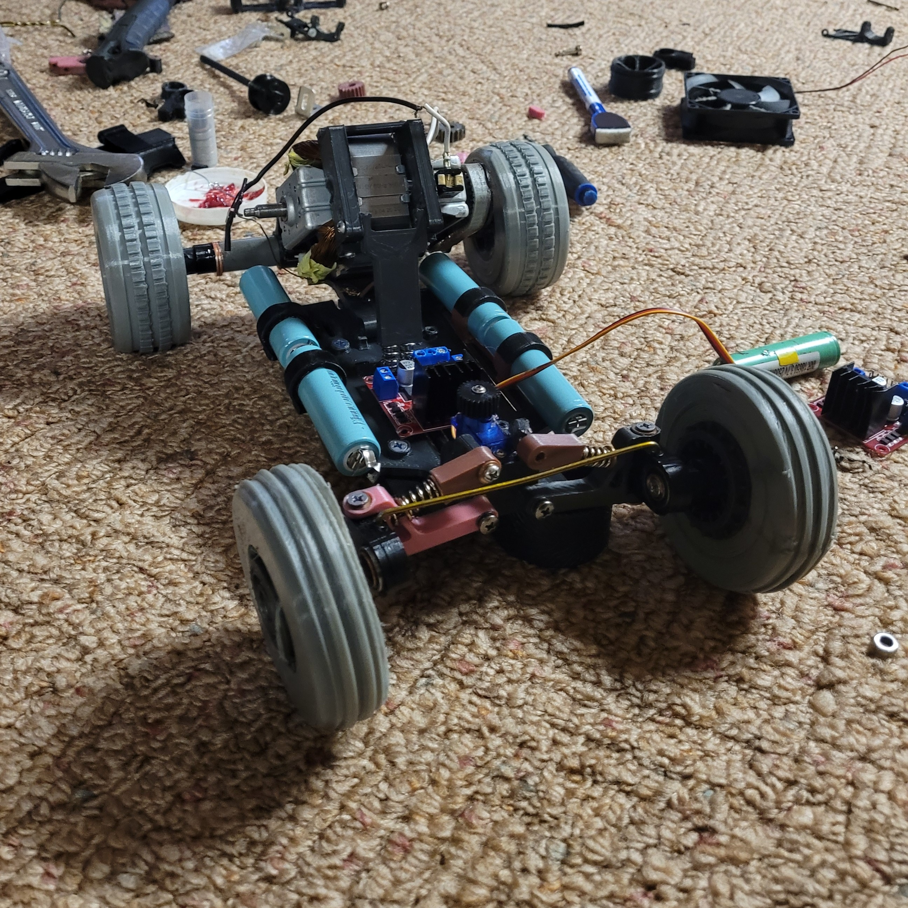

# Universal (AC Series) Motor Powered RC Car (Work in Progress)

  

What motivated me to attempt this project was learning how universal motors are wired. Their wiring allows them to operate on both AC and DC power sources due to the stator and rotor windings being connected in series, though due to this you can't control its direction. However, when these windings are supplied separately from a DC source, it becomes possible to control torque and speed independently. This capability is especially beneficial in situations where high torque is required, such as when a vehicle is stuck against an obstacle and needs additional torque to overcome it.
  
## Motor Control System
The motor control system consists of:
- Two high-current motor driver boards  
- An ESP32 microcontroller  
- A FlySky FS-IA10B receiver and FlySky Remote
- An AC series motor (separate stator and rotor windings)  
- Servo motors for steering  

One motor driver controls the stator windings, while the second driver controls the rotor windings. The ESP32 acts as the control interface between the FlySky receiver and the motor drivers, translating remote inputs into motor speed, torque, and direction commands.

The initial design used an L298N motor driver, rated for 3 A. This driver was insufficient for delivering the current required for the speed/torque of the AC series motor for this project.

To address this, the L298N was replaced with the **BTS7960 motor driver**, which is rated for up to 43 A.

Two BTS7960 drivers are used for:
- **Driver 1:** Controls power delivered to the stator windings (torque control)
- **Driver 2:** Controls power and direction of the rotor windings (speed and direction control)

Both drivers are powered by a 25 V Li-ion battery pack.

---

### Rotor Windings (Speed & Direction)
- Primary control of motor speed and direction  
- Direction control via **control pins 40 and 42**
- Speed controlled using a **PWM signal on pin 44** generated by the ESP32

### Stator Windings (Torque Control)
- Used to control motor torque independently of speed
- At low speeds, higher power is supplied to increase torque
- At higher speeds, stator power is reduced to limit current draw

This approach enables independent control of **torque and rotational speed**.

---

The initial system architecture used a Raspberry Pi 4 as an intermediary between the radio receiver and the motor drivers. This was later replaced with an ESP32, as the Raspberry Pi’s additional processing capability and operating system overhead were unnecessary for a real-time motor control application, and also because I fried the Raspberry Pi :). The ESP32 provides a simpler and more deterministic control platform while still offering sufficient performance for signal decoding and PWM generation.

The ESP32 is programmed to receive iBUS serial data from a FlySky FS-IA10B 10-channel 2.5 GHz receiver, which supports both individual PWM outputs and a serial iBUS interface. Communication over this protocol is handled using the IBusBM library. Serial communication is initialized using IBus.begin(Serial2, 1), where pin 1 of the ESP32 is connected to the receiver’s iBUS output.

The FlySky transmitter is configured to transmit the throttle signal on channel 2 of the iBUS stream. This signal is decoded by the ESP32 and converted into appropriate PWM duty cycles for the stator and motor drivers. Channel 5 is mapped to a switch on the transmitter and is used to control motor direction. The ESP32 continuously monitors this channel and reverses motor direction when the switch state changes by actuating the motor driver connected to the rotor windings.

Servo motors are connected directly to the FlySky receiver, as they accept standard PWM signals and therefore do not require any intermediate signal translation.

## Power System (Batteries, Voltage Regulator)

## 3D Design and Fabrication

  

## Progress Photos

